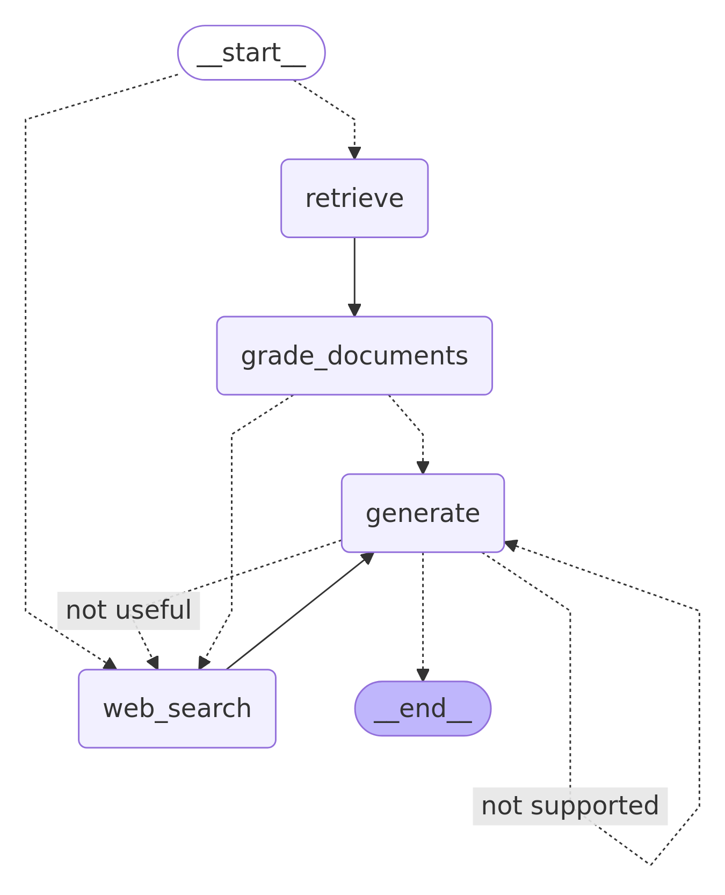

# Agentic RAG Pipelines (Learning Project)

This repository is a sandbox for exploring and learning about Retrieval-Augmented Generation (RAG) pipelines using modern Python tools like LangChain, LangGraph, and various LLMs. **This is not a production project**—it's just for personal experimentation and learning!

## What does this project do?
- Loads and ingests documents from the web
- Splits, embeds, and stores documents in a vector database (Chroma)
- Retrieves relevant documents for a user question
- Grades the relevance of retrieved documents with an LLM
- Optionally performs web search if retrieval is insufficient
- Generates answers using retrieved or searched content

## Key Technologies
- Python 3.11+
- [LangChain](https://github.com/langchain-ai/langchain)
- [LangGraph](https://github.com/langchain-ai/langgraph)
- [ChromaDB](https://www.trychroma.com/)
- [OpenAI API](https://platform.openai.com/)
- [Tavily Web Search](https://python.langchain.com/docs/integrations/tools/tavily_search_api)
- dotenv for configuration

## Graph Visualization

Below is the current workflow graph for this project, automatically generated from the code:



## Quickstart
1. **Clone the repo & install dependencies:**
   ```bash
   git clone https://github.com/AdityaC4/agentic-rag-pipeline.git
   cd agentic-rag-pipelines
   poetry install
   ```
2. **Set up your `.env` file:**
   - Copy `.env.example` to `.env` and fill in your API keys (OpenAI, Tavily, etc).
3. **Run the main pipeline:**
   ```bash
   poetry run python main.py
   ```
4. **Run tests:**
   ```bash
   pytest . -s -v
   ```

## Notes
- The ingestion process can be optimized further; here, defaults are used to focus on retrieval and graph-based workflow.

Happy experimenting! 🚀
